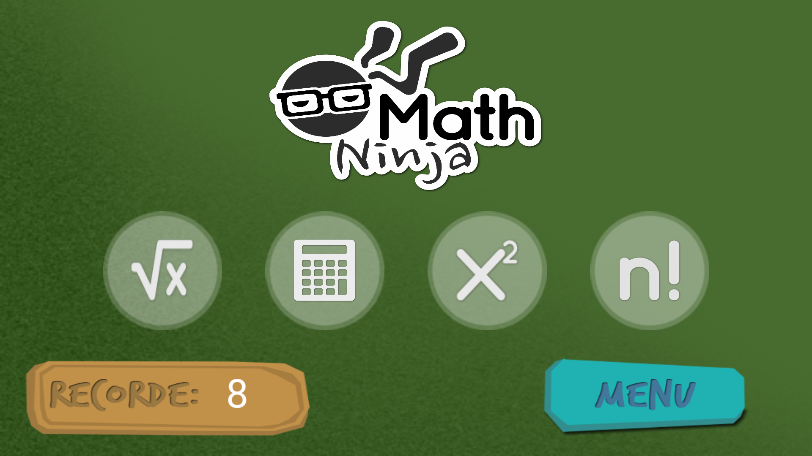

# Math Ninja
Desenvolvido para Trabalho de Estágio 1 - FA7

## Demo

## Sumário

* [Enredo](#enredo)
* [Objetivo Geral](#objetivo-geral)
* [Objetivos Específicos](#objetivos-específicos)
* [Tecnologias Utilizadas](#tecnologias-utilizadas)

# Enredo
Math Ninja é um jogo para dispositivos móveis. Inspirado no fruit ninja tem o objetivo de ensinar alguns conteúdos matemáticos de forma divertida, além de testar o tempo de reação e raciocínio do jogador. 

# Objetivo Geral

* Fazer com que o jogador aprenda e realize cálculos de forma rápida

# Objetivos Específicos

* Aprender conteúdos
* Acertar o maior número de questões por temas
* Acertar a pengunta antes do tempo esgotar 

# Regras do Jogo

* Ao destruir a bomba o jogador perderá o jogo.

* A cada pergunta uma dessas 3 bolas contém a resposta.

* O jogador possui 10 segundos para responder a questão, caso não responda o jogador perderá 1 uma vida 

# Tecnologias Utilizadas

* Lua
* Simulador Corona SDK